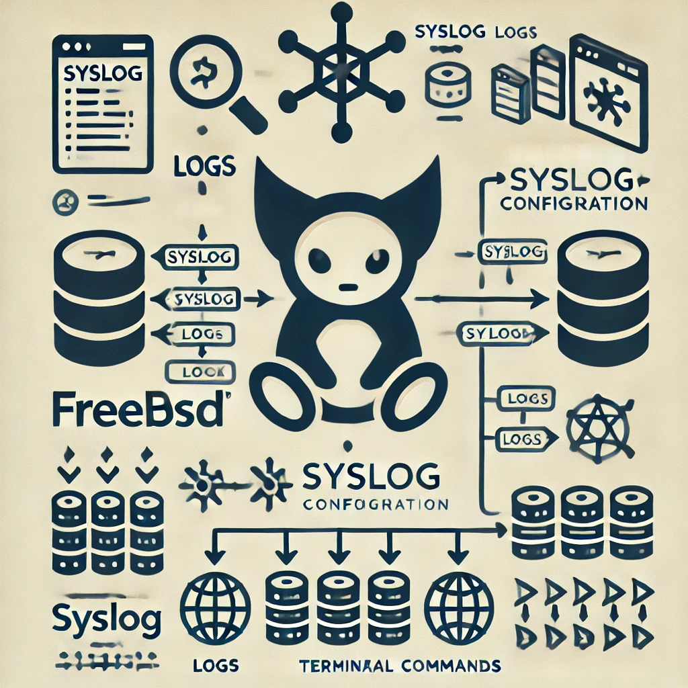

# Logs
Repositories for teaching purposes at SPOS DK

Repository pro vyuku na SPOS DK



## Logování pomocí - Syslog

- Web server spos.pfsense.cz má nastaveno vzdálené logování pomocí syslog.

```console
cat /etc/syslog.d/remote-spos.conf 
# remote syslog spos.pfsense.cz
*.*   @192.168.5.7
```

- Na log serveru je toto nastavení pro příjem logů. Newsyslog zajišťtuje rotování logů.

```console
cat /etc/syslog.d/spos-osy-bsd.conf 
# spos-osy-bsd.conf
+192.168.5.221
*.*					/var/log/server/spos.pfsense.cz.log

cat /etc/newsyslog.conf.d/spos-osy-bsd.conf
/var/log/server/spos.pfsense.cz.log   	644  30  51200  *  JC
```

- Takto vypadá záznam v logu po přihlášení pomocí SSH na server.

```console
tail -f /var/log/server/spos.pfsense.cz.log | grep -vE "cron|dhclient"
Oct 30 21:12:14 192.168.5.221 sshd[25234]: Accepted publickey for malyl from 2a01:a040:2002:8041:fa76:5dd1:9540:a52b port 50580 ssh2: ED25519 SHA256:0ImwdCx87A+TLKIst3c/Sy0LhADJ9xGyuHdBdnWDLVg
Oct 30 21:12:14 192.168.5.221 devd[528]: Processing event '!system=DEVFS subsystem=CDEV type=CREATE cdev=pts/0'
Oct 30 21:12:14 192.168.5.221 devd[528]: Pushing table
Oct 30 21:12:14 192.168.5.221 devd[528]: Processing notify event
Oct 30 21:12:14 192.168.5.221 devd[528]: Popping table
Oct 30 21:12:20 192.168.5.221 devd[528]: Processing event '!system=DEVFS subsystem=CDEV type=DESTROY cdev=pts/0'
Oct 30 21:12:20 192.168.5.221 devd[528]: Pushing table
Oct 30 21:12:20 192.168.5.221 devd[528]: Processing notify event
Oct 30 21:12:20 192.168.5.221 devd[528]: Popping table
Oct 30 21:12:20 192.168.5.221 sshd[25236]: Received disconnect from 2a01:a040:2002:8041:fa76:5dd1:9540:a52b port 50580:11: disconnected by user
Oct 30 21:12:20 192.168.5.221 sshd[25236]: Disconnected from user malyl 2a01:a040:2002:8041:fa76:5dd1:9540:a52b port 50580
```

- Pomocí ChatGPT zjistěte co se děje při přihlášení a odhlásení pomocí ssh. V log souboru se zaměřte na sshd, ale více na devd.
