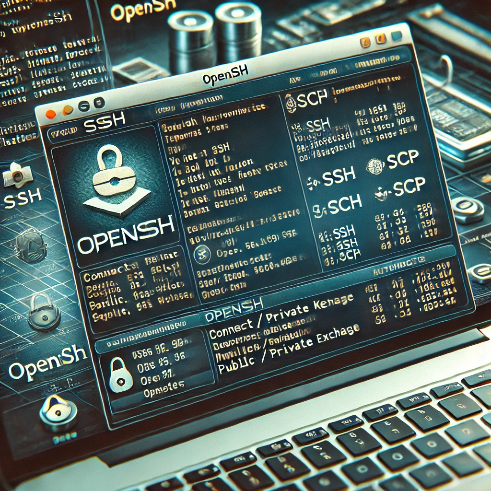

# SSH
Repositories for teaching purposes at SPOS DK

Repository pro vyuku na SPOS DK



## SSH klienti, desktop a mobil

- SSH klientů existuje celá řada. Zde si uvedeme jen zlomek toho co se dá používat.

### SSH klienti desktop

- [OpenSSH je ve Windows](https://learn.microsoft.com/en-us/windows-server/administration/openssh/openssh-overview), hurá. Pustíme cmd.exe nebo PowerShell.exe a na příkazové řádce můžeme používat 

```console
malyl@HP-Z420-Workstation:~$ ssh spos.pfsense.cz
Last login: Thu Oct 24 08:53:45 2024 from 2a01:a040:2002:8051:fd1:823d:b241:3e9c
FreeBSD 14.1-RELEASE-p5 GENERIC

Welcome to FreeBSD!

Do you wonder what a terminal program is doing at the moment? dd(1) does not
show any throughput? Hit "^T" (Control + t) to send SIGINFO to the process
and see what it is doing.

		-- Lars Engels <lme@FreeBSD.org>
[malyl@spos ~]$
```

- [PuTTY](https://www.chiark.greenend.org.uk/~sgtatham/putty/) je free implementace of SSH kterou napsal [Simon Tatham](https://www.chiark.greenend.org.uk/~sgtatham/)
- [vagrant ssh](https://developer.hashicorp.com/vagrant/docs/cli/ssh) - je způsob, jak skrze Vagrant můžeme zavolat ssh a přihlásit se na Vagrantem vytvořený server.

### SSH klienti mobil

- Mobilní klient pro Android [JuiceSSH](https://juicessh.com/) - instalace snadná v rámci Google Play [JuiceSSH - SSH Client](https://play.google.com/store/apps/details?id=com.sonelli.juicessh)
- Mobilni klient pro iOS - Apple [Termius](https://termius.com/free-ssh-client-for-iphone) - instalace snadná v rámci App Store [Termius: Terminal & SSH client ](https://apps.apple.com/us/app/termius-terminal-ssh-client/id549039908)

...
