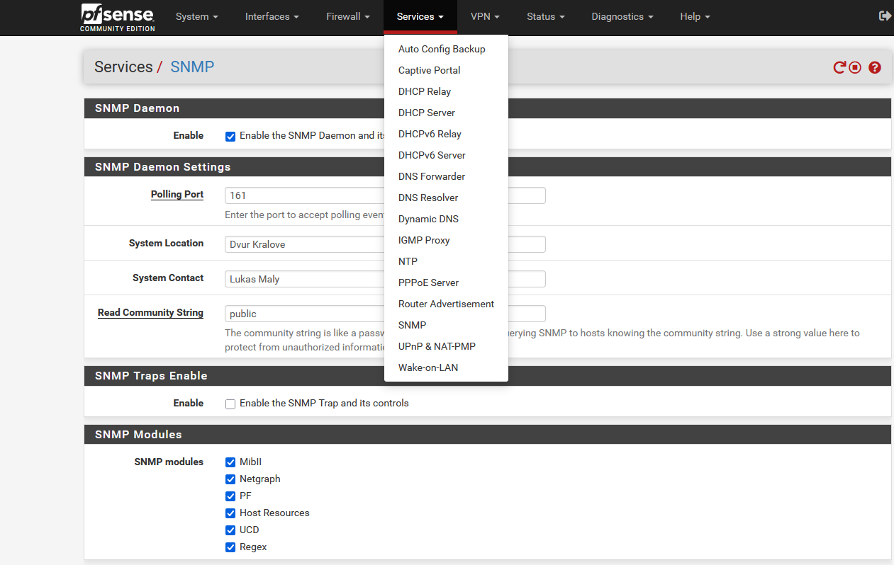
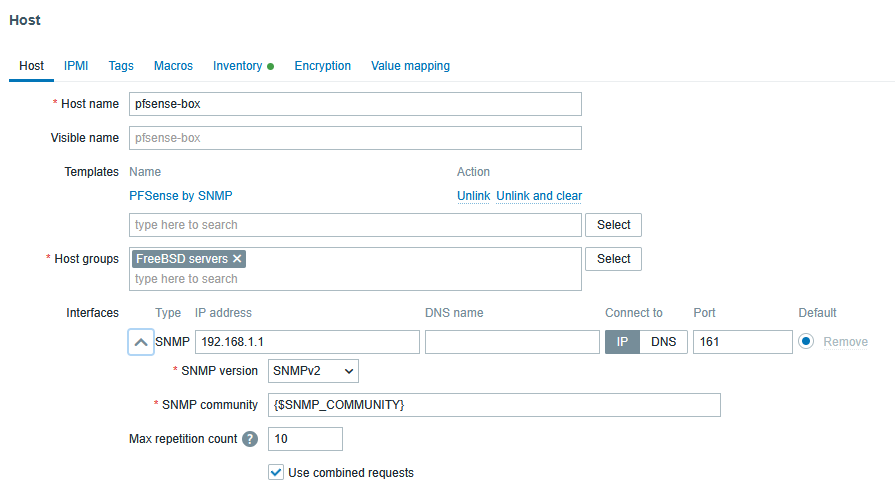

# pfSense router - SNMP
Repositories for teaching purposes at SPOS DK

Repository pro vyuku na SPOS DK


## Vagrant pfSense a monitoring SNMP pomoci Zabbix

- Použijeme Vagrant pro snadnou a rychlou instalaci pfSense ve virtualním prostredo VirtualBox
- Pomocí připravéného Vagrantfile nainstaluje pfSense CE
- Podrobná [dokumentace](https://portal.cloud.hashicorp.com/vagrant/discover/cs-c4300/pfsense) k Vagrant instalaci pfSense na stránkách portal.cloud.hashicorp.com.

### Instalace pfSense

- Použijte patřičný instalační adresář v ročníkovém projektu [2024-sposdk-osy](https://github.com/sposdknl/2024-sposdk-osy)
- Projekt si clonujte clone nebo aktualizujte pull pomocí programu git
- Prohlédněte si použitý [Vagrantfile](https://github.com/sposdknl/2024-sposdk-osy/blob/main/Install/pfSnese/Vagrantfile)

```console
cd 2024-sposdk-osy/
git pull
cd Install/pfSnese
vagrant up
```
### První přihlášení do Web GUI pfSense

- to access pfSense on https://localhost:8888
- Web: admin, admin
- ssh admin@localhost -p 2222
- SSH: vagrant, vagrant nebo admin, admin

```console
ssh admin@localhost -p 2222
(admin@localhost) Password for admin@pfSense.home.arpa:
VirtualBox Virtual Machine - Netgate Device ID: 57aedd694474c9c3a678

*** Welcome to pfSense 2.7.2-RELEASE (amd64) on pfSense ***

 WAN (wan)       -> em0        -> v4/DHCP4: 10.1.1.101/16
 LAN (lan)       -> vtnet1     -> v4: 192.168.1.1/24
 OPT1 (opt1)     -> vtnet0     -> v4: 10.0.2.15/24

 0) Logout (SSH only)                  9) pfTop
 1) Assign Interfaces                 10) Filter Logs
 2) Set interface(s) IP address       11) Restart webConfigurator
 3) Reset webConfigurator password    12) PHP shell + pfSense tools
 4) Reset to factory defaults         13) Update from console
 5) Reboot system                     14) Disable Secure Shell (sshd)
 6) Halt system                       15) Restore recent configuration
 7) Ping host                         16) Restart PHP-FPM
 8) Shell

Enter an option: 
```

## Rekonfigurace Zabbix appliance

- Změnte nastavení sítě tak, aby se Zabbix dostal do pfSense skrze LAN interface (Vnitřní síť - intnet)
- Nastavte statickou IPv4 v Zabbix Apliance na interface eth1

```console
cd /etc/sysconfig/network-scripts

vi ifcfg-eth1

DEVICE="eth1"
BOOTPROTO=none
ONBOOT="yes"
NM_CONTROLLED="no"
TYPE=Ethernet
NAME="eth1"
IPADDR=192.168.1.2
PREFIX=24
DEFROUTE=no
PEERDNS=no
PEERROUTES=no

systemctl restart network.service
```

## Konfigurace pfSense a test fungovani SNMP v2

- Povolte SNMP službu v nastavení pfSense menu Services / SNMP
- Doinstalujte balicek net-snmp-utils 
- Ověřte fungovaní SNMP pomocí snmpwalk ze Zabbix serveru



```console
dnf install net-snmp-utils

snmpwalk -v2c -c public 192.168.1.1 system
SNMPv2-MIB::sysDescr.0 = STRING: pfSense pfSense.home.arpa 2.7.2-RELEASE FreeBSD 14.0-CURRENT amd64
SNMPv2-MIB::sysObjectID.0 = OID: SNMPv2-SMI::enterprises.12325.1.1.2.1.1
DISMAN-EVENT-MIB::sysUpTimeInstance = Timeticks: (896904) 2:29:29.04
SNMPv2-MIB::sysContact.0 = STRING: Lukas Maly
SNMPv2-MIB::sysName.0 = STRING: pfSense.home.arpa
SNMPv2-MIB::sysLocation.0 = STRING: Dvur Kralove
SNMPv2-MIB::sysServices.0 = INTEGER: 76
```

## Monitorujte hosta pfSense



- Vytvořte hosta pfsense-box
- Nastavte SNMP interface na spravnoi IPv4 a port
- Nastavte, nalinkujte šablonu - [PFSense by SNMP](https://git.zabbix.com/projects/ZBX/repos/zabbix/browse/templates/app/pfsense_snmp)
- Ověřte fungování monitoringu SNMP
...
