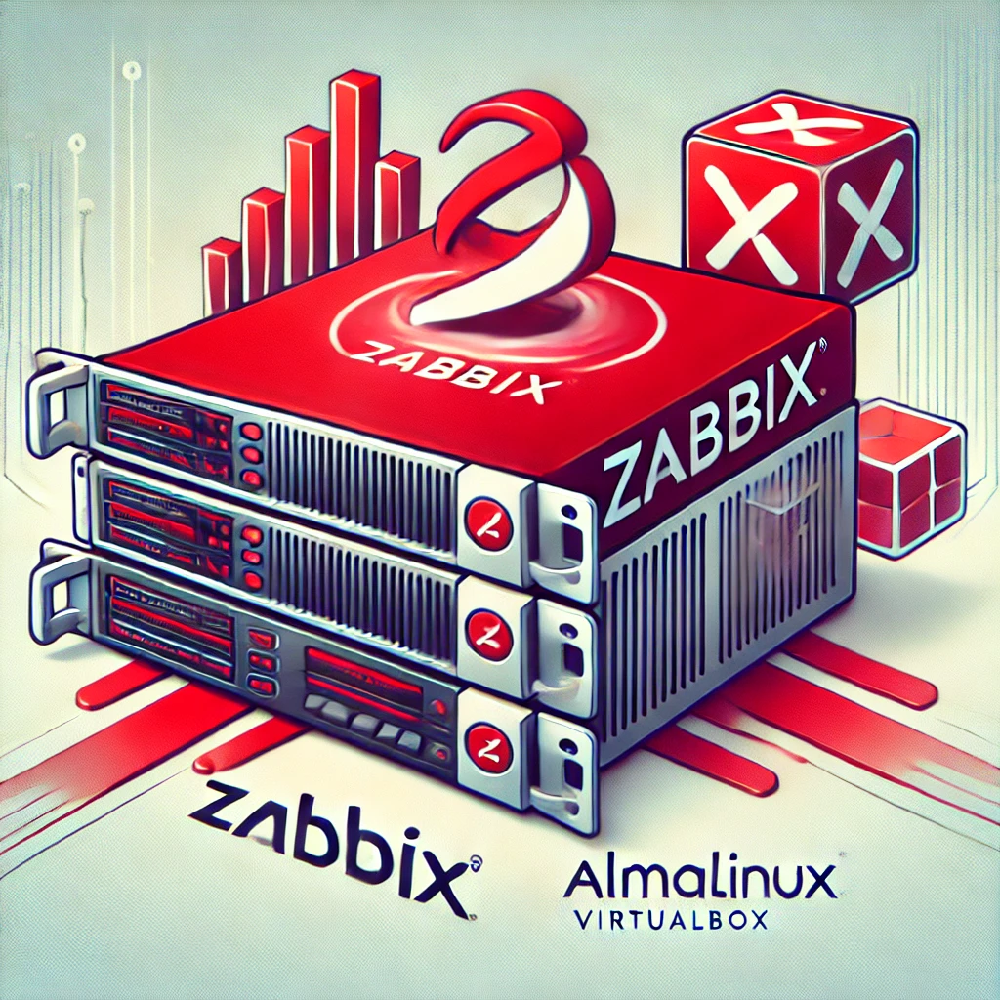

# Zabbix Appliance
Repositories for teaching purposes at SPOS DK

Repository pro vyuku na SPOS DK



## Install Zabbix Appliance 7.0 LTS

- Pro zprovoznění použijte soubor "Open virtualization format (.ovf)"
- Po deploy nevypínat, jinak se nedokončí interní konfigurace - vytvoření hesel do DB
- Podrobná [dokumentace](https://www.zabbix.com/documentation/7.0/en/manual/appliance) na stránkách Zabbix.

### Konfigurace Install Zabbix Appliance

- Nastavte portforward na úrovni VirtualBoxu - 80 na 8080 a 22 na 2200
- Posléze se přihlašte pomoci SSH a WebGUI vyměňte Zabbix agenta, doinstalujte Zabbix Agent2
- http://127.0.0.1:8080 - user Admin heslo zabbix
- ssh root@127.0.0.1 -p 2200 - heslo zabbix

```console
dnf install -y zabbix-agent2

systemctl stop zabbix-agent
systemctl disable zabbix-agent

systemctl enable zabbix-agent2
systemctl start zabbix-agent2

tail -f /var/log/zabbix/zabbix_agent2.log
```

### Zprovozněte monitoring MySQL

- V Zabbix GUI vytvořte nového hosta MySQL Database např. jako klon Zabbix server
- Nalinkujte šablonu [MySQL by Zabbix agent 2](https://git.zabbix.com/projects/ZBX/repos/zabbix/browse/templates/db/mysql_agent2)
- Vytvořte db usera a heslo viz dokumentace k šabloně
- Upravte Makra hosta

```console
mysql
use mysql

CREATE USER 'zbx_monitor'@'%' IDENTIFIED BY 'SPOS_2025_OSY';
GRANT REPLICATION CLIENT,PROCESS,SHOW DATABASES,SHOW VIEW ON *.* TO 'zbx_monitor'@'%';
```

### Makra

```console
{$MYSQL.USER}		zbx_monitor
{$MYSQL.PASSWORD}	SPOS_2025_OSY
{$MYSQL.DSN}		tcp://localhost:3306
```

### Kontrola funkčnosti

- Test discovery databází - Database discovery
- Kliknětě na tlačítko Test a získejte LLD JSON

```console
[{"Database":"information_schema"},{"Database":"mysql"},{"Database":"performance_schema"},{"Database":"sys"},{"Database":"zabbix"}]
```
...
