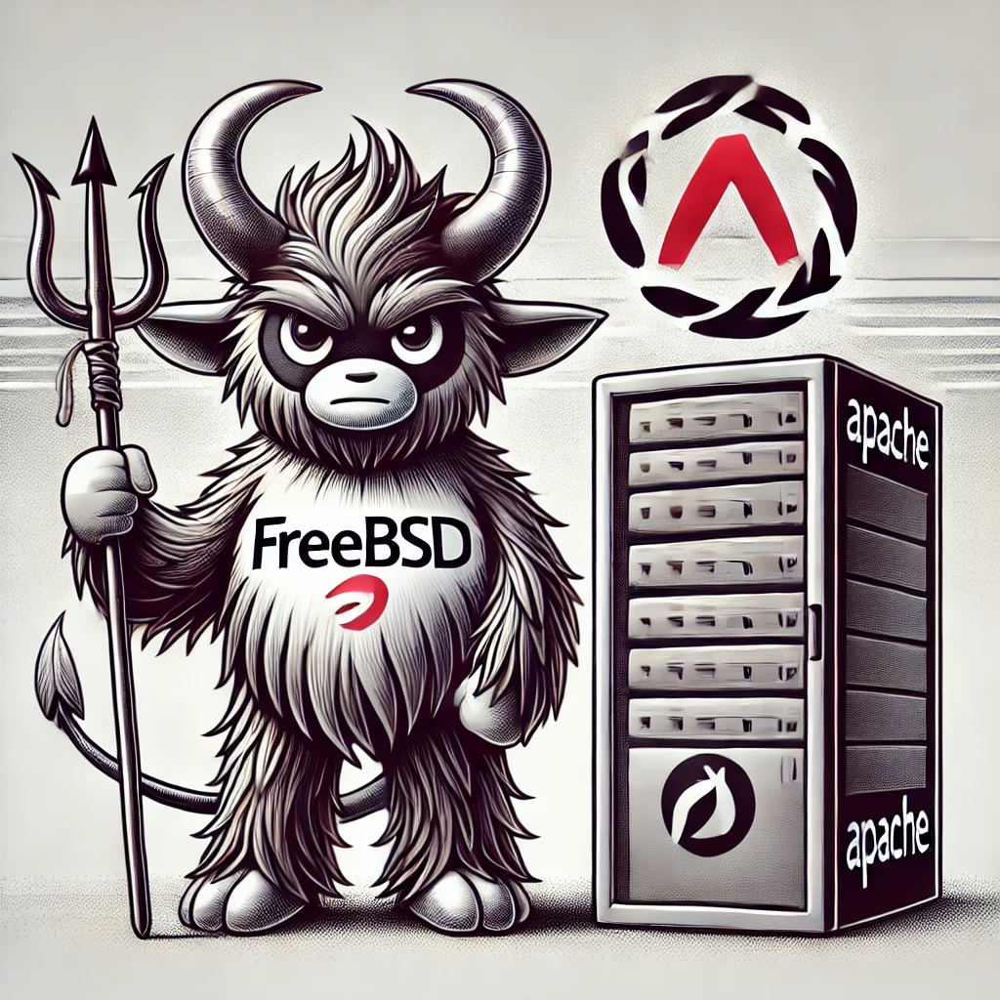

# Install Apache on FreeBSD
Repositories for teaching purposes at SPOS DK



Repository pro vyuku na SPOS DK

## Automatická instalace OS FreeBSD a Web server Apache24

- Vagrantfile obsahuje sekci pro aplikaci příkazů pro instalaci web serveru
  [Apache](https://httpd.apache.org/).

```console
pkg update
pkg install -y apache24

/usr/local/etc/rc.d/apache24 enable
/usr/local/etc/rc.d/apache24 restart
```
...