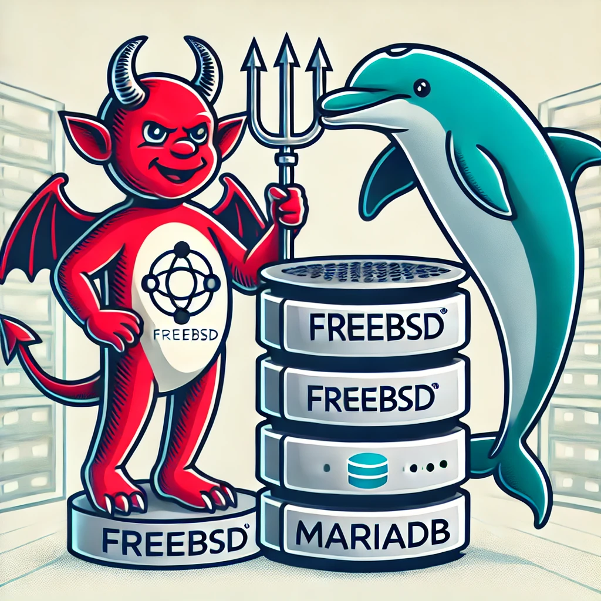

# Install MariaDB on FreeBSD
Repositories for teaching purposes at SPOS DK



Repository pro vyuku na SPOS DK

## Automatická instalace OS FreeBSD and SQL database MariaDB

- Vagrantfile obsahuje sekci pro aplikaci příkazů pro instalaci databaze
  [MariaDB](https://mariadb.org).

```console
pkg install -y mariadb114-server

/usr/local/etc/rc.d/mysql-server enable
/usr/local/etc/rc.d/mysql-server restart
```
...