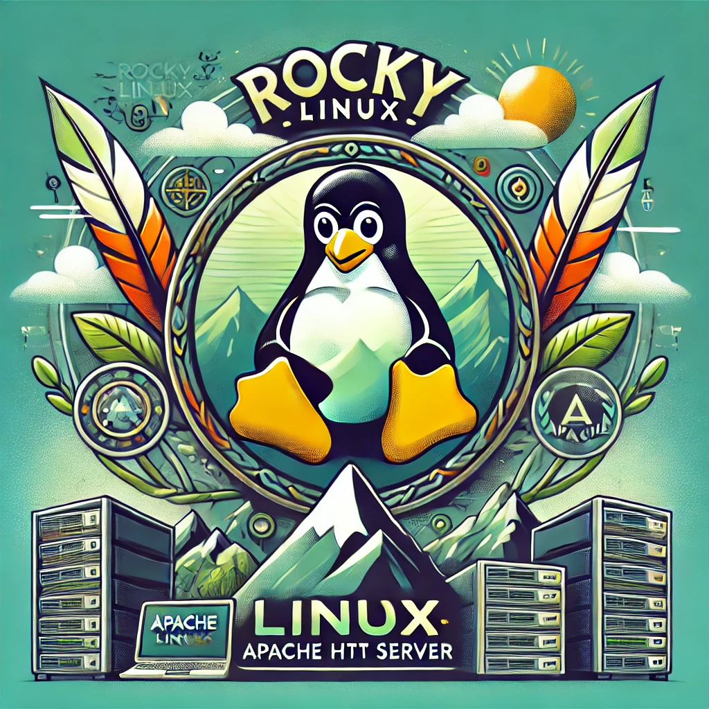

# Install Apache on RockyLinux
Repositories for teaching purposes at SPOS DK



Repository pro vyuku na SPOS DK

## Automatická instalace OS RockyLinux a Web server Apache2

- Vagrantfile obsahuje sekci pro aplikaci příkazů pro instalaci web serveru
  [Apache](https://httpd.apache.org/).

```console
dnf update
dnf install -y httpd

systemctl enable httpd
systemctl restart httpd
```
...